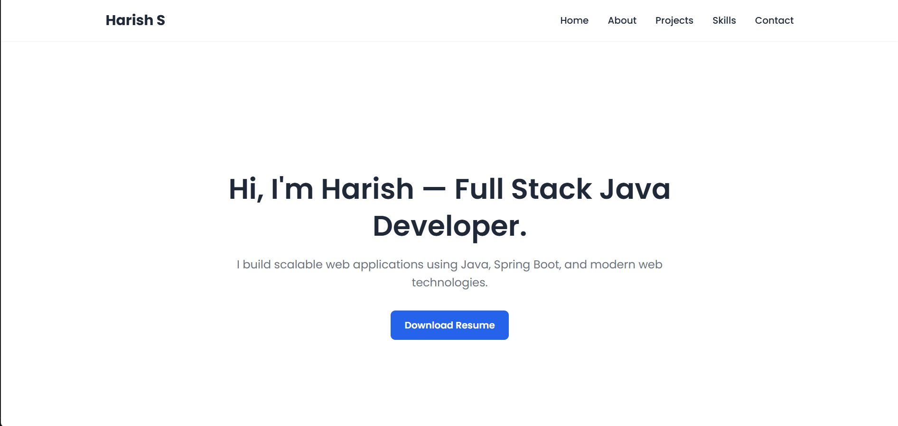
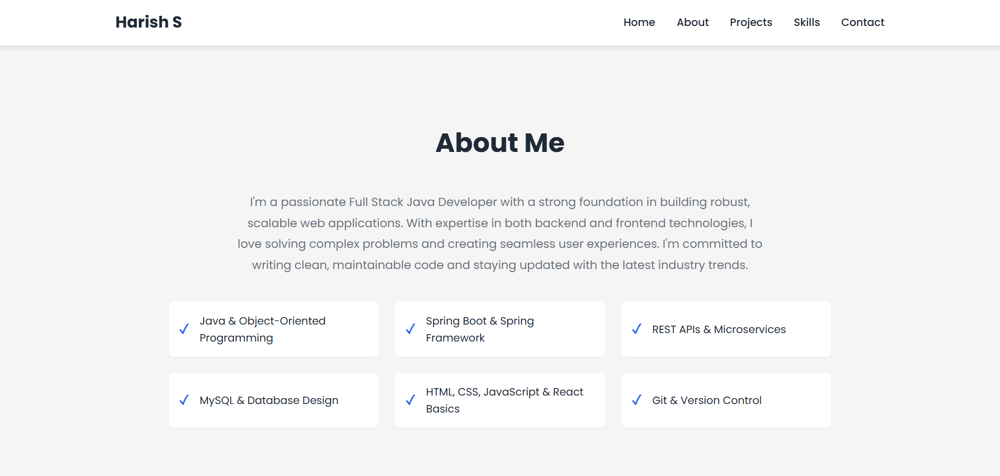
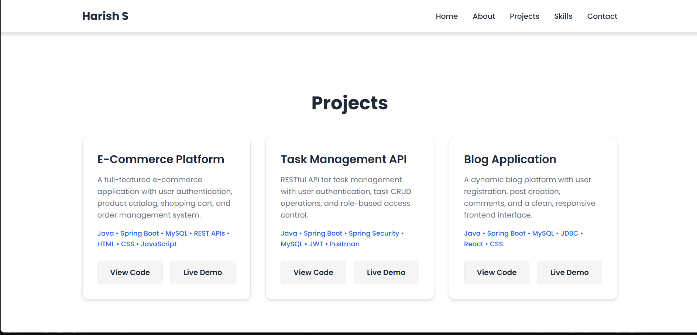
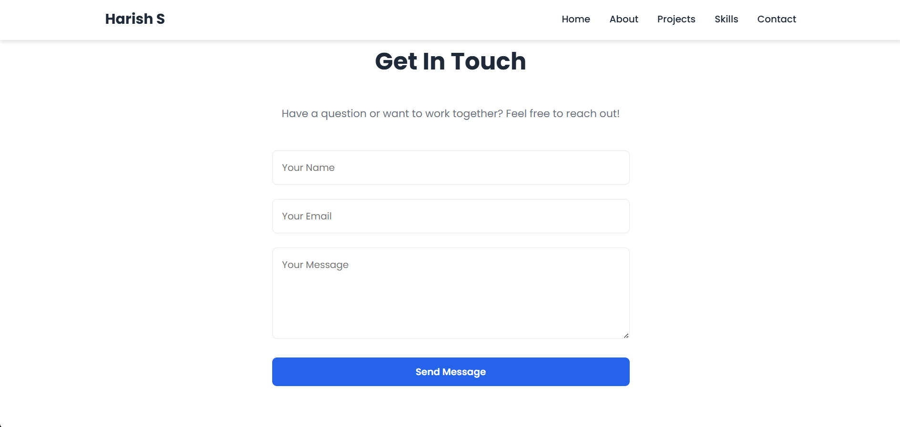
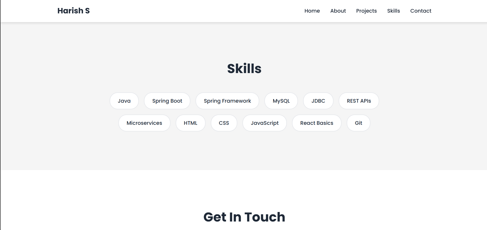

# Harish Portfolio

A professional portfolio website showcasing my skills as a **Full Stack Java Developer**.  
Built with HTML, CSS, and JavaScript, this portfolio highlights my projects, skills, and contact information.

---

## 🌐 Live Demo
[View Live Portfolio](https://harish-portfolio-1617.netlify.app/)

---

## 🖼 Screenshots

### Hero Section


### About Me Section


### Projects Section


### Contact Section


### Skills Section


---

## ✨ Features
- Fully responsive design (mobile & desktop)
- Clean, modern layout
- Downloadable resume
- Contact form integrated
- Showcases projects with screenshots
- Built entirely with HTML, CSS, and JavaScript

---

## 🛠 Tech Stack
- **Frontend:** HTML5, CSS3, JavaScript
- **Backend:** None (Static portfolio)
- **Tools:** VS Code, Git & GitHub

---

## 💻 How to Run Locally
1. Clone the repository:
   ```bash
   git clone https://github.com/Harish-1617/harish-portfolio.git
